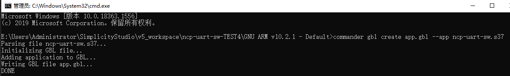

# gl-silabs-dfu

本工程采用Xmodem协议基于silicon xmodem-uart-bootloader进行固件升级。


## Getting Start

```shell
$ git clone https://gitlab.com/gl.iot/gl-silicon-dfu.git
```


## Run gl-silabs-dfu:

```shell
gl-silabs-dfu [Upgrade file path] [Uart] [Reset IO] [DFU enable IO]
```


## GBL File Creation

### 环境部署
找到commander.exe的安装路径，并将该路径添加到系统Path环境变量,如下图：


### 生成未加密的GBL文件
打开工程文件，找到生成的 .s37 文件的路径，并在该路径下打开CMD命令行窗口，输入如下命令格式：

```shell
$ commander gbl create <gblfile> --app <filename> [--encrypt <keyfile>]
```

如下图所示，在当前目录下生成了未加密的GBL文件

